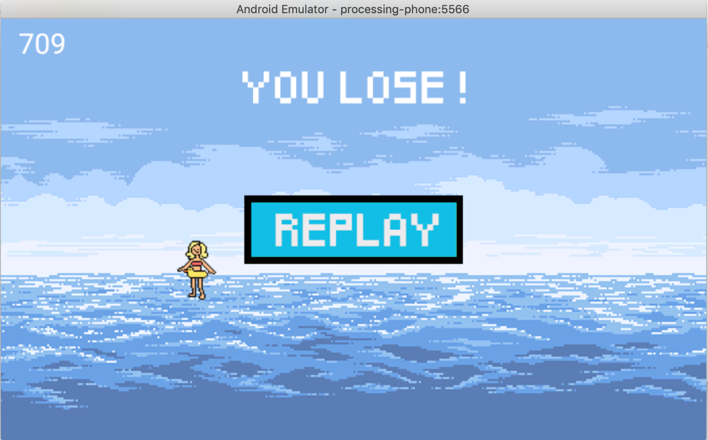

# Wave-surfer
WaveSurfer is a 2D Android Game developed in Java with Processing.
The aim of the game is to dodge the different missiles propulse by the generator of the game.
Each projectile spawns to a different location and could has a different velocity. The game integrate the notions of gravity, velocity and wind. More your score is high, more the projectiles will arrive faster.

<h2>Presentation of the game</h2>

<h2>You lost... but you can replay !</h2>

